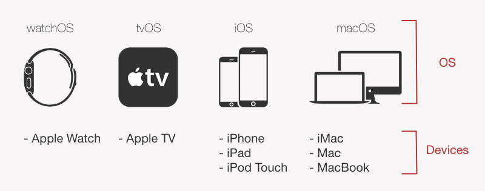
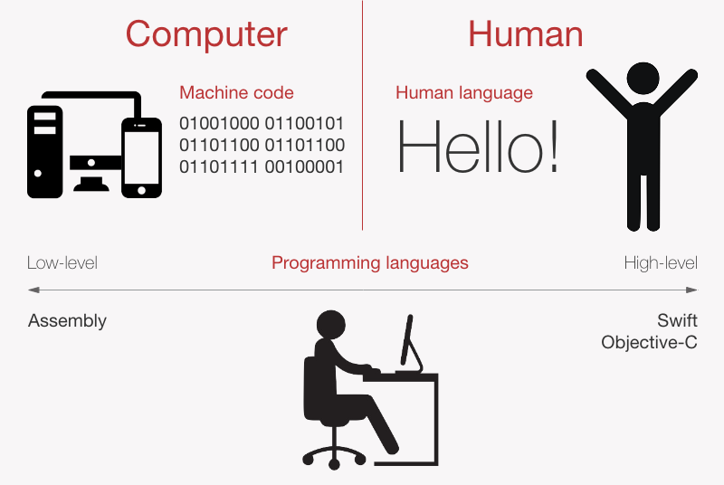

# IOS 开发环境
## IOS历史
自IOSD第一次发布后, IOS发生了巨大的变化. 每一个新的重大创新都会产生一个新的版本。每一年都会有一个新的版本发布.

苹果有四种操作系统: 

有两项重要的苹果活动你必须关注: 6月的WWDC和9月的Keynote。WWDC发布面向开发者的新软件,Keynote苹果宣布新的硬件，并为每个人提供新的软件。
## IOS开发战略
### 前端和后端
后端开发工程师负责完成服务器端的任务, 服务器角色通过必要的数据交换来支持客户端. 客户端应用指的是用户在他们的设备上直接交换的应用程序, 可以说前端开发就是负责实现客户端应用的完成.
### Native vs. hybrid
native应用是专门为特定平台开发的, hybrid 应用是独立于平台,与平台不相关.
## 编程语言
编程语言越高级,开发越有效率. 目前, IOS开发有两种编程语言: Objective-C 和 swift, 他们都是高级语言. 比如汇编语言(Assembly)就是最低级的编程语言.

Objective-C语言起源于1980s, 它被用来主要开发 NeXTSTEP 操作系统, NeXTSTEP是IOS和OS X操作系统的始祖. 直到2014年，Objective-C还是唯一一种为iOS设备开发原生应用的语言。
Swift在2014年苹果的WWDC (全球开发者会议)发布, 它起源于克里斯·拉特纳的作品,他起初的目的是为了改进Objective-C, 最终创建了Swift. 它得到了世界各地开发者的大力支持。2015年底，Swift成为开源软件。

