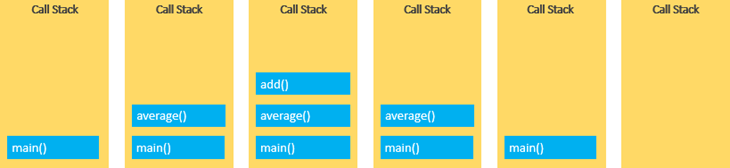
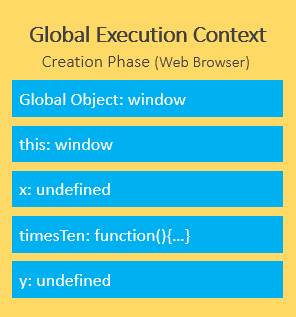
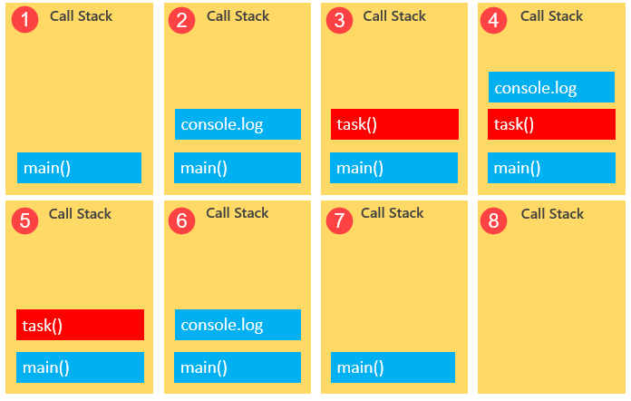
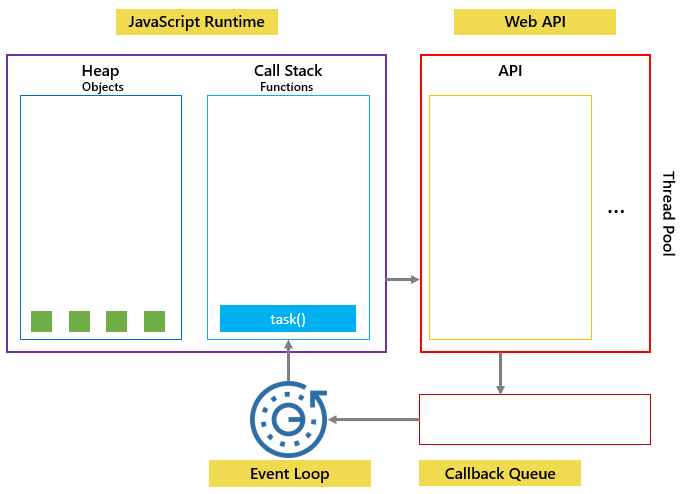
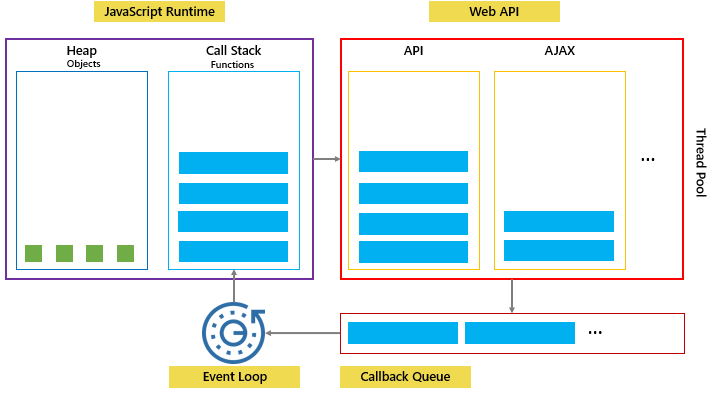

```JavaScript
const person = {
    firstName: 'John',
    lastName: 'Doe'
}

function greet(greeting, message) {
    return `${greeting} ${this.firstName}. ${message}`;
}

// use the apply() method to call the greet() function with the this set to the person object

let result = greet.apply(person, ['Hello', 'How are you?']);
console.log(result);

//use the call() method, you need to pass the arguments of the greet() function separately

let result = greet.call(person, Hello', 'How are you?');
```


## 使用apply()方法附加一个数组到另外一个数组

```JavaScript
let arr = [1, 2, 3];
let numbers = [4, 5, 6];

arr.push.apply(arr, numbers);

console.log(arr); 
```

--------------------------------------------------
```
```

##  正则表达式
{1,} 相当于(简写) +

{0,1} 相当于 ?

{0,} 相当于 *
- Whole numbers:/^\d+$/
- Decimal numbers:/^\d*.\d+$/
- Whole numbers and decimal numbers:/^\d*(.\d+)?$/
- Negative, positive whole numbers & decimal numbers:/^-?\d*(.\d+)?$/

|*			|Match zero or more times.	|
|+			|Match one or more times.	|
|?			|Match zero or one time.	|
|{ n }		|Match exactly n times.		|
|{ n ,}		|Match at least n times.	|
|{ n , m }	|Match from n to m times.	|

## JavaScript Call Stack
JavaScript引擎使用调用堆栈(call stack)来管理执行上下文(execution contexts)：全局执行上下文(Global Execution Context)和函数执行上下文(Function Execution Contexts)。

调用堆栈基于LIFO(后进先出)原则. 

当您执行脚本时，JavaScript引擎会创建一个全局执行上下文并将其推入调用堆栈的顶部。每当调用一个函数时，JavaScript引擎都会为该函数创建一个函数执行上下文，将其推入调用堆栈的顶部，然后开始执行该函数。

调用堆栈的大小固定，具体取决于Web浏览器或Node.js主机环境的实现。

### JavaScript call stack example
```
function add(a, b) {
    return a + b;
}

function average(a, b) {
    return add(a, b) / 2;
}

let x = average(10, 20);
```
下图说明了所有步骤中调用堆栈的总体状态：



## Asynchronous JavaScript
JavaScript调用堆栈可帮助跟踪执行上下文或函数调用。
JavaScript是单线程编程语言。 JavaScript引擎只有一个调用堆栈，因此一次只能执行一项操作.

执行脚本时，JavaScript引擎逐行从上至下执行代码。 换句话说，它是同步的。

异步与同步相反，这意味着同时发生。 JavaScript可以承载异步任务，例如回调，promise和async / await.

## JavaScript 执行上下文 (Execution Context)
当JavaScript引擎执行脚本时，它会创建执行上下文。 每个执行上下文都有两个阶段：创建阶段和执行阶段。
比如下面的例子:
```
let x = 10;

function timesTen(a){
    return a * 10;
}

let y = timesTen(x);

console.log(y); // 100
```
When a JavaScript engine executes a script, it creates execution contexts. Each execution context has two phases: the creation phase and the execution phase.

它的创建阶段(the creation phase):




执行阶段(The execution phase):


对每个函数调用, JavaScript引擎创建一个函数执行上下文(Function Execution Context) . 函数执行上下文和全局上下文 Global Execution Context相似, 不是创建全局对象，它创建了arguments对象，该对象包含对传递给函数的所有参数的引用:


the execution phase of the function execution context:


## JavaScript Event Loop
### JavaScript single-threaded model
JavaScript引擎从顶部开始执行脚本，然后逐步创建执行上下文并将函数推入和弹出调用堆栈。
JavaScript runtime运行时一次只能做一件事。
web浏览器除了JavaScript引擎,还有很多组件,. 当你调用 setTimeout() 方法, AJAX 被调用, 或者在点击按钮时, web浏览器能够并行一步处理这些行为.
setTimeout(), AJAX calls, and DOM events 是web浏览器的web APIs的一部分.
如果您要执行的功能要花很长时间，则执行该功能时您无法在网络浏览器上执行任何操作。 该网页只是挂起。
考虑如下情况:
```
function task(message) {
    // emulate time consuming task
    let n = 10000000000;
    while (n > 0){
        n--;
    }
    console.log(message);
}

console.log('Start script...');
task('Download a file.');
console.log('Done!');
```
task()模拟的是一个耗时的任务, 它就是一个阻塞函数.

JavaScript引擎执行脚本的过程:

### Callbacks to the rescue
为阻止阻塞函数阻碍其他行为,可以把这些行为打包放在回调里面. 如下:
```
console.log('Start script...');

setTimeout(() => {
    task('Download a file.');
}, 1000);

console.log('Done!');
```
在我们的示例中，当调用setTimeout（）函数时，将其放在调用堆栈上，并且Web API创建一个计时器，该计时器将在1秒后过期。


然后将task（）函数放入称为回调队列或任务队列的队列中：


事件循环(Event loop)是一个持续运行的过程，它同时监视回调队列和调用堆栈。
如果调用堆栈不为空，则事件循环将一直等到它为空，然后将下一个函数从回调队列放置到调用堆栈中。 如果呼叫队列为空，则不会发生任何事情：



下图说明了JavaScript运行时，Web API，调用堆栈和事件循环：


JavaScript事件循环是一个持续运行的过程，可协调调用堆栈和回调队列之间的任务以实现并发。

## 提升(Hoisting)
JavaScript提升发生在执行上下文的创建阶段，该阶段将变量和函数声明移到脚本的顶部。
JavaScript引擎会提升使用let关键字声明的变量，但不会将其初始化为使用var关键字声明的变量。
函数表达式和箭头函数未悬挂。
### Function hoisting
```
let x = 20,
    y = 10;

let result = add(x,y);
console.log(result);

function add(a, b){
return a + b;
}
```
相当于:
```
function add(a, b){
    return a + b;
}

let x = 20,
    y = 10;

let result = add(x,y);
console.log(result);
```

### function expression
将add从一般方法改成方法表达式:
```
let x = 20,
    y = 10;

let result = add(x,y);
console.log(result);

var add = function(x, y) {
return x + y;
}
```
这样会报错:
```
"TypeError: add is not a function   
```

### arrow function
将add方法表达式改成箭头函数:
```
let x = 20,
    y = 10;

let result = add(x,y);
console.log(result);

var add = (x, y) => x + y;
```
也会出现和函数表达式同样的错.