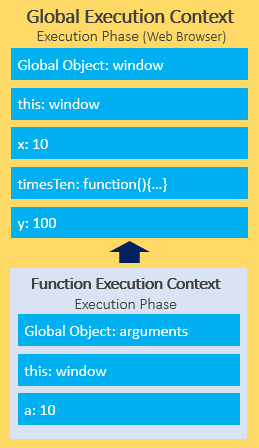

```JavaScript
const person = {
    firstName: 'John',
    lastName: 'Doe'
}

function greet(greeting, message) {
    return `${greeting} ${this.firstName}. ${message}`;
}

// use the apply() method to call the greet() function with the this set to the person object

let result = greet.apply(person, ['Hello', 'How are you?']);
console.log(result);

//use the call() method, you need to pass the arguments of the greet() function separately

let result = greet.call(person, Hello', 'How are you?');
```


## 使用apply()方法附加一个数组到另外一个数组

```JavaScript
let arr = [1, 2, 3];
let numbers = [4, 5, 6];

arr.push.apply(arr, numbers);

console.log(arr); 
```

--------------------------------------------------
```

```

Boolean和boolean

boolean是带有true和false两个值的原始类型。JavaScript也提供全局的Boolean()方法，用来将其他类型的值转换成boolean.

```
let a = Boolean('Hi');
console.log(a); // true
console.log(typeof(a)); // boolean
```

Boolean也是boolean原始类型的包装对象，可以向Boolean构造函数传递true或者false

```
let b = new Boolean(false);
console.log(b.valueOf()); // false
```


## 语法

JavaScript 中的变量，函数名，类名和操作符都是区分大小写的。

### 标识符

第一个字符必须是字母（a-z或A-Z），下划线（_）或美元符号（$）。

其他字符可以是字母（a-z，A-Z），数字（0-9），下划线（_）和美元符号（$）。

最好使用驼峰式大小写作为标识符

### 语句

建议语句末尾加分号。原因是分号将使您的代码更具可读性，并帮助您避免可能遇到的许多问题。另外，在将JavaScript代码部署到生产环境之前，可能需要对其进行组合和压缩，以消除多余的空白以节省带宽。 没有分号，您将有语法错误。

### 关键字和保留字

不能使用关键字和保留字作为标识符。

## 数据类型

JavaScript有六种原始数据类型：

1. [`null`](https://www.javascripttutorial.net/javascript-data-types/#null)

2. [`undefined`](https://www.javascripttutorial.net/javascript-data-types/#undefined)

3. [`boolean`](https://www.javascripttutorial.net/javascript-data-types/#boolean)

4. [`number`](https://www.javascripttutorial.net/javascript-data-types/#number)

5. [`string`](https://www.javascripttutorial.net/javascript-data-types/#string)

6. [`symbol`](https://www.javascripttutorial.net/javascript-data-types/#symbol) – available only from ES6

   还有一种称为对象的复杂数据类型。

##  正则表达式

{1,} 相当于(简写) +

{0,1} 相当于 ?

{0,} 相当于 *
- Whole numbers:/^\d+$/
- Decimal numbers:/^\d*.\d+$/
- Whole numbers and decimal numbers:/^\d*(.\d+)?$/
- Negative, positive whole numbers & decimal numbers:/^-?\d*(.\d+)?$/

|*			|Match zero or more times.	|
|+			|Match one or more times.	|
|?			|Match zero or one time.	|
|{ n }		|Match exactly n times.		|
|{ n ,}		|Match at least n times.	|
|{ n , m }	|Match from n to m times.	|


## JavaScript 执行上下文 (Execution Context)
当JavaScript引擎执行脚本时，它会创建执行上下文。 每个执行上下文都有两个阶段：创建阶段和执行阶段。
比如下面的例子:
```
let x = 10;

function timesTen(a){
    return a * 10;
}

let y = timesTen(x);

console.log(y); // 100
```
When a JavaScript engine executes a script, it creates execution contexts. Each execution context has two phases: the creation phase and the execution phase.

它的创建阶段(the creation phase):


执行阶段(The execution phase):


对每个函数调用, JavaScript引擎创建一个函数执行上下文(Function Execution Context) . 函数执行上下文和全局上下文 Global Execution Context相似, 不是创建全局对象，它创建了arguments对象，该对象包含对传递给函数的所有参数的引用:


the execution phase of the function execution context:



## JavaScript调用堆栈

当执行脚本时，JavaScript引擎创建一个Global Execution Context ，将其推入调用 堆栈的顶部。当调用一个函数时，JavaScript引擎为函数创建一个Function Execution Context，将其推入调用 堆栈的顶部,然后开始执行函数。如果函数调用另外一个函数，JavaScript引擎会为其创建一个新的Function Execution Context，将其推入调用 堆栈的顶部.

JavaScript引擎使用调用堆栈(call stack)来管理执行上下文(execution contexts)：全局执行上下文(Global Execution Context)和函数执行上下文(Function Execution Contexts)。

调用堆栈基于LIFO(后进先出)原则. 

当您执行脚本时，JavaScript引擎会创建一个全局执行上下文并将其推入调用堆栈的顶部。每当调用一个函数时，JavaScript引擎都会为该函数创建一个函数执行上下文，将其推入调用堆栈的顶部，然后开始执行该函数。

调用堆栈的大小固定，具体取决于Web浏览器或Node.js主机环境的实现。

### 示例

```
function add(a, b) {
    return a + b;
}

function average(a, b) {
    return add(a, b) / 2;
}

let x = average(10, 20);
```

下图说明了所有步骤中调用堆栈的总体状态：


### 异步JavaScript

JavaScript调用堆栈可帮助跟踪执行上下文或函数调用。
JavaScript是单线程编程语言。 JavaScript引擎只有一个调用堆栈，因此一次只能执行一项操作.

执行脚本时，JavaScript引擎逐行从上至下执行代码。 换句话说，它是同步的。

异步与同步相反，这意味着同时发生。 JavaScript可以承载异步任务，例如回调，promise和async / await.

## JavaScript 事件循环

JavaScript基于事件循环实现并发模型。

### JavaScript 单线程模式

JavaScript是单线程编程语言，一次只能做一件事。

JavaScript引擎从顶部开始执行脚本，然后逐步创建执行上下文并将函数推入和弹出调用堆栈。
准确的说，JavaScript runtime运行时一次只能做一件事。
web浏览器除了JavaScript引擎,还有很多组件,. 当你调用 setTimeout() 方法, AJAX 被调用, 或者在点击按钮时, web浏览器能够并行一步处理这些行为.
setTimeout(), AJAX calls, and DOM events 是web浏览器的web APIs的一部分.
如果您要执行的功能要花很长时间，则执行该功能时您无法在网络浏览器上执行任何操作。 该网页只是挂起。
考虑如下情况:

```
function task(message) {
    // emulate time consuming task
    let n = 10000000000;
    while (n > 0){
        n--;
    }
    console.log(message);
}

console.log('Start script...');
task('Download a file.');
console.log('Done!');
```
task()模拟的是一个耗时的任务, 它就是一个阻塞函数.

JavaScript引擎执行脚本的过程:

### Callbacks to the rescue
为阻止阻塞函数阻碍其他行为,可以把这些行为打包放在回调里面. 如下:
```
console.log('Start script...');

setTimeout(() => {
    task('Download a file.');
}, 1000);

console.log('Done!');
```
在我们的示例中，当调用setTimeout（）函数时，将其放在调用堆栈上，并且Web API创建一个计时器，该计时器将在1秒后过期。


然后将task（）函数放入称为回调队列或任务队列的队列中：


事件循环(Event loop)是一个持续运行的过程，它同时监视回调队列和调用堆栈。
如果调用堆栈不为空，则事件循环将一直等到它为空，然后将下一个函数从回调队列放置到调用堆栈中。 如果呼叫队列为空，则不会发生任何事情：


下图说明了JavaScript运行时，Web API，调用堆栈和事件循环：


JavaScript事件循环是一个持续运行的过程，可协调调用堆栈和回调队列之间的任务以实现并发。

## 提升(Hoisting)
JavaScript提升发生在执行上下文的创建阶段，该阶段将变量和函数声明移到脚本的顶部。
JavaScript引擎会提升使用let关键字声明的变量，但不会将其初始化为使用var关键字声明的变量。
函数表达式和箭头函数未悬挂。
### Function hoisting
```
let x = 20,
    y = 10;

let result = add(x,y);
console.log(result);

function add(a, b){
return a + b;
}
```
相当于:
```
function add(a, b){
    return a + b;
}

let x = 20,
    y = 10;

let result = add(x,y);
console.log(result);
```

### function expression
将add从一般方法改成方法表达式:
```
let x = 20,
    y = 10;

let result = add(x,y);
console.log(result);

var add = function(x, y) {
return x + y;
}
```
这样会报错:
```
"TypeError: add is not a function   
```

### arrow function
将add方法表达式改成箭头函数:
```
let x = 20,
    y = 10;

let result = add(x,y);
console.log(result);

var add = (x, y) => x + y;
```
也会出现和函数表达式同样的错.


## Fetch API

使用Javascript fetch api发生异步HTTP请求. Fetch API是一种现代接口，可让您从Web浏览器向服务器发出HTTP请求。

### 发送请求

fetch方法接收一个参数，它是请求资源的URL地址

`let response = fetch(url);`

fetch方法返回promise，能够使用then()和catch()方法处理

```
fetch(url)
    .then(response => {
        // handle the response
    })
    .catch(error => {
        // handle the error
    });
```

请求完成后，资源可用。 这时，promise将解析为Response对象。


# 闭包


内部函数访问外部函数中的局部变量，就构成了闭包，如果内部函数被当做返回值返回出去没有被销毁，那么那个外部函数的局部变量不会被销毁，正常来说函数里面的变量的作用域出了大括号就会被销毁，闭包改变了这种规则


