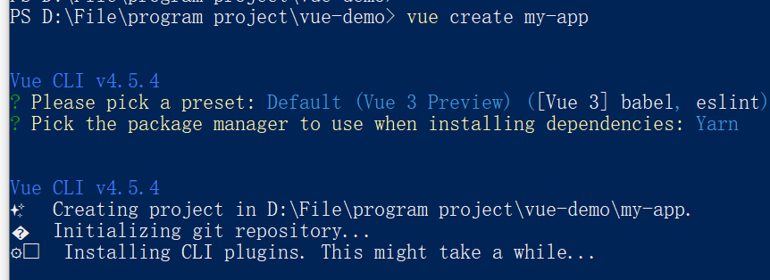
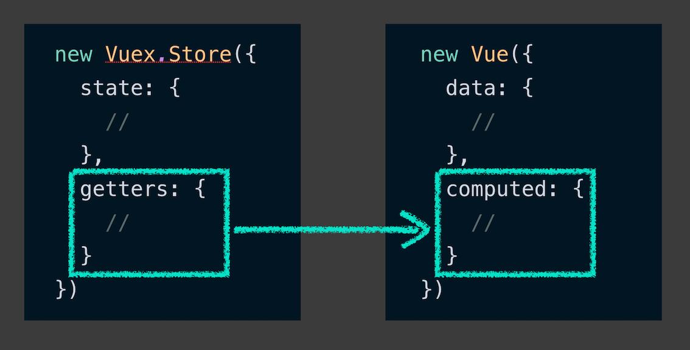

# Vue Cli创建项目
## 背景
构建工具（Gulp, Webpack等）和命令行的出现，改进了以前在前端开发中很多东西都需要手动配置，比如根据文件内容来包含CSS，为了缩小加载时间最小化JavaScript文件的大小。
由于这些构建工具存在的复杂性，企业级应用程序必须使用命令行界面（CLI）.
## 安装Vue Cli
```javascript
npm install -g @vue/cli
// OR
yarn global add @vue/cli
```
检查是否安装成功：
```
vue --version
```
## 创建项目
开始创建项目：

构建完成的项目结构目录：

* node_modules- 包含能在应用中实现很多东西的所有依赖，它不需要提交到代码库，是由npm来管理的。
* public- 此文件夹包含favicon.ico和index.html,此处包含的所有内容将直接通过根网址提供。
* index.html将用于生成应用程序的其余部分。
* src - 大部分代码将在这里进行
* gitignore - 包含不被提交到仓库的文件或目录列表，像常见的/dist目录（每一次项目构建都会自动生成），node_modules目录（每一次npm install  or  yarn install都会自动创建）。
* package.json- 项目的基本配置。包含像项目名称，版本的元数据。包含重要信息，例如可以运行（即serve和build）脚本以及项目需要哪些依赖项。
	+ Serve- 该脚本用于启动本地开发环境
	+ Build- 该脚本负责创建最终代码工件的脚本，该工件将交付给客户或用户。

src目录：
* Assets - 您可以在此目录中放置诸如图像和可能需要参考的其他必需资产之类的内容
* Components - 放项目用到的组件
* main.js - 这是设置高级Vue配置选项的地方。
启动项目：
```
npm run serve
or
yarn run serve
```

# Vue Router管理导航
## 安装
使用 Vue CLI工具给项目加vue router
```
vue add router
```
添加完成后会新产生一个文件router/index.js. main.js也会有些变化。

router/index.js

```javascript
import Vue from 'vue' 
import Router from 'vue-router' 
import Home from './views/Home.vue'

Vue.use(Router)

export default new Router({
  routes: [
    {
      path: '/',
      name: 'home',
      component: Home
    },
    {
      path: '/about',
      name: 'about',
      // route level code-splitting
      // this generates a separate chunk (about.[hash].js) for this route
      // which is lazy-loaded when the route is visited.
      component: () => import(/* webpackChunkName: "about" */ './views/About.vue')
    }
  ]
})
```
Vue app中的routers是通过一个包含对象的数据来定义的，每个对象包含三个关键的属性：
* Path - 哪个URL应该与组件匹配
* Name - 用于标记和测试
* Component - 匹配路径时应显示的组件

Vue Router使用两个组件：
* &lt;router-view&gt;&lt;/router-view&gt; - 定义我们在每条路由中定义的组件将出现在页面上的区域。
* &lt;router-link&gt;&lt;/router-link&gt; - 类似于HTML中的锚点标签，它比标准锚标记更可取，因为它具有内置功能，例如防止自动重新加载页面。

这两个组件构成了在我们的组件中使用Vue Router的基础，以帮助简化Vue应用程序内的导航。
## 动态匹配路由
希望菜单项有单独的页面，但只想使用单个ItemDetail.vue页面来显示菜单项的详细信息； 您将需要路由来动态传递这些信息。
Vue路由器通过允许动态路由匹配来解决此问题。
配置路由如下：
```javascript
const router = new VueRouter({
    routes: [
        // dynamic segments start with a colon
        { path: '/item/:name', component: ItemDetail }
    ]
})
```
动态变量（可能会在URL中更改）由冒号标记。
这样，组件ItemDetail便可以下拉参数来使用
```javascript
<div>Item: {{ $route.params.name }}</div>
```

# 组件生命周期
在组件的生命周期中，需要注意三个主要的里程碑：
1. Create - 这表示构建组件的时间段。
2. Mount - 这表示组件将在页面上呈现的时间。
3. Destroy - 这表示要从页面中删除组件的时间。


为了帮助解决计时问题，Vue等框架公开了lifecycle hooks生命周期挂钩
1. beforeCreate
2. created
3. created
4. mounted
5. beforeDestroy
6. destroyed
从列表中可以看到，每个里程碑都带有一对生命周期挂钩，使我们可以在里程碑之前和之后执行代码。

## 使用Lifecycle Hooks
与定义data或者computed类似，他们只是另外一种属性，区别只是他们不是简单的字符串，而是函数
```javascript
<template>
    <h1>I'm a new component!</h1>
</template>

<script>
    export default {
        data: { msg: 'Hello!' },
        beforeCreate() { console.log('I have not been created yet!') },
        created() { console.log('I have just been created!') },
        beforeMount() { console.log('I am about to be mounted to the DOM!') },
        mounted() { console.log('I am mounted to the DOM!') },
        beforeDestroy() { console.log('I am about to be removed from the DOM!') },
        destroyed() { console.log('I no longer exist...') }
    }
</script>
```

# 管理样式
## 配置预处理器
有一种更简便的方法来利用预处理器的功能，同时又使它们与组件耦合
假设您已使用正确的预处理器配置了Vue CLI应用程序，那么就可以使用所需的预处理器将lang prop赋予样式块。

```javascript
<template>

</template>

<script>

</script>

<style lang="scss">
.button {
    &.is-small { ... }
    &.is-large { ... }
}
</style>
```
## 管理样式
* Global Styling - style块种无另外的配置，样式是全局的
* Scoped Styles - style块中有scoped属性，样式只会应用在当前组件的元素.
就其尝试方式而言，它将自定义数据属性附加到CSS类和HTML元素以使样式保持范围。这通过减小范围来最小化级联效果。
Before

```html
<style scoped>
.example {
    color: red;
}
</style>

<template>
    <div class="example">hi</div>
</template>
```

Afer

```html
<style>
.example[data-v-f3f3eg9] {
    color: red;
}
</style>

<template>
    <div class="example" data-v-f3f3eg9>hi</div>
</template>
```
对于大多数样式而言，这通常不是什么大问题，但是当类似.button之类的东西与第三方CSS结合使用时，可能会出现问题。
* CSS Modules - CSS模块是用于模块化和组合CSS的流行系统
```httml
<style module>
.red {
    color: red;
}
.bold {
    font-weight: bold;
}
</style>
```
和scoped styles一样，在style块中加 module属性，它将会附加一个随机的希哈值给样式
```html
<style>
.red-vj29193 {
    color: red;
}
.bold-vj2914 {
    font-weight: bold;
}
</style>
```

使用CSS模块需要在v-bind：class中用$ style附加CSS类。

```html
<template>
	<h1 :class="$style.red">My Red Title</h1>
</template>

<style module>
.red {
  color: red;
}
</style>
```
## 管理样式策略
保持样式与组件的耦合

不要将所有样式都写在一个全局样式文件中，如果不是这些样式都重复用到。如果放到一个样式文件中，即使用户不会用的到这些样式也会一起下载所有样式数据。
而且，使用遗留代码会给生活带来困难，因为在不了解副作用的情况下很难进行重构。
```css
.button {
    background-color: blue;
    color: white;
    border-radius: 10px;
}
```
另一方面，如果您使用Vue管理我们的样式：
```javascript
<template>
    <button class="button">{{ text }}</button>
</template>

<script>
export default {
    name: 'CustomButton',
    props: ['text']
}
</script>

<style>
    .button {
        background-color: blue;
        color: white;
        border-radius: 10px;
    }
</style>
```

# 将事件发送到父组件
常见的事件包括点击,提交表单,改变浏览器大小,按键盘, 发生这些操作时，将发出事件，因此您可以使用事件处理程序之类的技术进行相应的响应。
事件也会自动传递给事件对象，该对象包含额外的功能或有关事件的信息。 例如，当用户按下键盘上的一个键时，事件对象可以让您知道按下了哪个键。
## 自定义事件
使用v-on指令能够很容易的监听常见的事件并触发你想要执行的函数. 使用Vue内置的$emit函数能自定义事件. $emit函数有两个参数:
* 事件名称
* 可选的有效负载(payload)，可用于将数据传递到事件侦听器

**src/ChildComponent.vue**
```javascript
<template>
    <button @click="emitCustomEvent">Emit Event</button>
</template>

<script>
export default {
    methods: {
        emitCustomEvent() {
            this.$emit('custom-event-name', { message: 'My custom message' })
        }
    }
}
</script>
```
## 监听并响应发送过来的事件

发出事件后，使用子组件的父组件可以通过v-on指令侦听该事件。
 1. 在发出事件的组件上添加带有自定义事件名称的v-on侦听器。
 2. 给它分配一个方法，该方法将接收有效载荷(payload)作为第一个参数（如果存在）。

**src/ParentComponent.vue**
```javascript
<template>
    <div>
        <p>{{ message }}</p>
        <!-- Listen for custom event here and assign a method -->
        <ChildComponent @custom-event-name="setMessage" />
    </div>
</template>

<script>
import ChildComponent from './ChildComponent'

export default {
    components: { ChildComponent },
    data () {
        return {
            message: 'Hi'
        }
    },
    methods: {
        // Define method that will use the payload to update the data property
        setMessage(payload) {
            this.message = payload.message
        }
    }
}
</script>
```
$event.target 指发送事件的元素；
Vue提供了一个$ listeners属性，其中包含在组件上使用的侦听器对象。

# Vuex
## 用Vuex创建集中数据存储

Vuex是Vue.js应用程序的状态管理模式和库。 换句话说，Vuex的唯一目的是帮助创建集中化的数据存储，该存储将作为应用程序的SSOT( single source of truth )。
使用Vue CLI tool 安装Vuex

```
vue add vuex
```

安装完成后， 会在应用对src/main.js文件产生变化：

```javascript
import Vue from 'vue'
import App from './App.vue'
import store from './store'

Vue.config.productionTip = false

new Vue({
    store,
    render: h => h(App)
}).$mount('#app')
```
这里插件引入了store,它作为一个新的配置在Vue实例中。

与在Vue实例中配置data属性类似，Vuex在src/store.js这样配置store：

```javascript
import Vue from 'vue'
import Vuex from 'vuex'

Vue.use(Vuex)

export default new Vuex.Store({
    state: {

    },
    mutations: {

    },
    actions: {

    }
})
```
**Vue.use(Vuex)**是Vue插件系统中的语法，它允许向Vue实例添加全局功能。
Vue 实例通过new Vue()设置，Vuex 通过new Vuex.Store()设置。新的Vuex store实例接收一个单一的配置对象。
## 存取数据
使用$store属性访问
```javascript
<template>
    <p>The date stored in Vuex is {{ $store.state.year }}-{{ $store.state.month }}-{{ $store.state.day }}.</p>
</template>
```
## 使用mapState
通过$store在组件中访问数据看起来有点乱，Vuex提供了一种更简单的方式mapState：匹配state到组件中的变量。
这种方式通过将我们需要请求的state属性加到组件的计算属性。
```javascript
export default new Vuex.Store({
    state: {
        month: 08,
        day: 12,
        year: 2008
    }
}
```
```javascript
<template>
    <p>The date stored in Vuex is {{ year }}-{{ month }}-{{ day }}.</p>
</template>

<script>
import { mapState } from 'vuex'

export default {
    computed: {
        ...mapState(['year', 'month', 'day'])
    }
}
</script>
```
...扩展符是通常的做法，是允许定义其他计算的属性。
为避免名称冲突,可以使用将数组参数换成对象参数给 Vuex state变量指定一个不一样的名称：
```javascript
<template>
    <p>The date stored in Vuex is {{ customYear }}-{{ uniqueMonth }}-{{ day }}.</p>
</template>

<script>
import { mapState } from 'vuex'

export default {
    computed: {
        ...mapState({
            customYear: 'year',
            uniqueMonth: 'month',
            day: 'day'
        })
    }
}
</script>
```
## Getter
store.js初始化缺少的一个重要属性：Getter， Vuex的getters属性类似于vue对象中的计算属性。



我们来定义一个格式化的日期：
```javascript
export default new Vuex.Store({
    state: {
        month: 08,
        day: 12,
        year: 2008
    },
    getters: {
        formattedDate: state => {
            return `${state.year}-${state.month}-${state.day}`
        }
    }
}
```
每一个getter都是接收state作为参数的函数，再返回一个值为后面访问。
我们可以在组件中使用mapGetters来进一步简化代码：
```javascript
<template>
    <p>The date stored in Vuex is {{ formattedDate }}.</p>
</template>

<script>
import { mapGetters } from 'vuex'

export default {
    computed: {
        ...mapGetters(['formattedDate'])
    }
}
</script>
```
和mapState一样，你也可以使用一个对象来为你正在引用的getter自定义名称。
## 修改Vuex中的数据
### Mutation
了解完在Vuex中用state和getter定义数据，用方法像mapState  和  mapGetters取数据，下一步就是管理数据，
用mutations更新修改Vuex 中的数据。
store.js文件初始化时：
```javascript
import Vue from 'vue'
import Vuex from 'vuex'

Vue.use(Vuex)

export default new Vuex.Store({
    state: {

    },
    mutations: {

    },
    actions: {
    
    }
})
```
mutations包含所有属性负责更改state状态的对象.
####  定义Mutation
```javascript
export default new Vuex.Store({
    state: {
        count: 0
    },
    mutations: {
        INCREASE_COUNT(state, payload) {
            state.count += Number(payload)
        }
    },
    actions: {

    }
})
```
####  提交Mutation
调用mutation 不像普通函数，它使用commit。当要提交mutation，这个动作取两个参数：
* mutation 的名称
* Payload（可选）

```javascript
this.$store.commit('INCREMENT_COUNT', 2)
```
当一个mutation提交后，修改便会立刻产生，换句话说就是Vuex mutations 是同步的，这样就不能从API中取数据。
### Actions
Actions是我们用来协调突变背后逻辑的主要工具。Actions 类似于Vue实例中的methods属性：


#### 定义Action
```javascript
export default new Vuex.Store({
    state: {
        count: 0
    },
    mutations: {
        INCREASE_COUNT(state, amount = 1) {
            state.count += Number(amount)
        }
    },
    actions: {
        incrementCount(context, amount) {
            context.commit('INCREMENT_COUNT', amount)
        }
    }
})
```
action 由它的名称，上下文参数和一个可选的payload组成。
#### Actions的作用
当我们做减法
```javascript
export default new Vuex.Store({
    state: {
        count: 0
    },
    mutations: {
        INCREASE_COUNT(state, amount = 1) {
            state.count += Number(amount)
        },
        DECREASE_COUNT(state, amount = 1) {
            state.count -= Number(amount)
        }
    },
    actions: {
        incrementCount(context, amount) {
            context.commit('INCREMENT_COUNT', amount)
        }
    }
})
```
我们需要处理一些逻辑来决定触发每个mutation