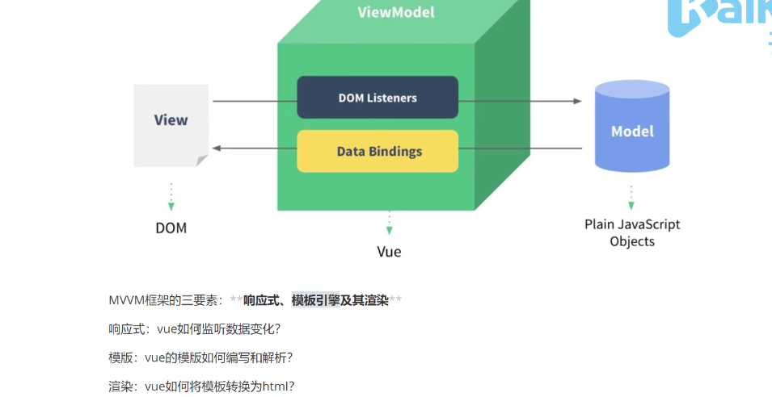

# 开发环境

##  vscode智能提示功能
##  调试
###  默认支持node调试，F5启动调试;
### 启动网页调试
 需要安装debugger for chrome, 启动本地服务器:
全局安装http-server,运行命令yarn -g http-server ，http-server启动服务

## 扩展
安装vetur（可以高亮显示代码）和vue vscode snippets（智能快速代码填充）
## 小结
vs快捷生成html: !+enter
vs快速生成vue单文件结构：vbase
输入vfor快速生成循环列表

# Vue设计思想
* 数据驱动应用
* MVVM模式践行者
--------------------------------------------------


# 模板语法
插入普通文本和属性绑定：{{}} 和 v-bind（即:）

**列表渲染**: 

```javascript
<div v-for="c in courses" :key="c">
{{c}}
</div>
```
**用户输入**

你可以用 v-model 指令在表单  <input>、<textarea>  及 <select> 元素上创建双向数据绑定。它 会根据控件类型自动选取正确的方法来更新元素。 v-model 本质上是语法糖。它将转换为输入事件以 更新数据，并对一些极端场景进行一些特殊处理。

范例：新增课程

```
<!-- 表单输入绑定 -->
<input v-model="course" type="text" v-on:keydown.enter="addCourse"/>
```

**事件处理**

可以用 v-on 指令监听 DOM 事件，并在触发时运行一些 JavaScript 代码。

事件名称用羊肉串方式编写，避免用驼峰式，因为HTML不区分大小写

范例：新增课程

```
<!-- 事件处理 -->
<button v-on:click="addCourse">新增课程</button>
<script>
    const app = new Vue({
        methods: {
            addCourse() {
            	this.courses.push(this.course);
            }
        },
    })
</script>
```

[事件处理](https://cn.vuejs.org/v2/guide/events.html)

**class与style绑定**

操作元素的 class 列表和内联样式是数据绑定的一个常见需求。因为它们都是属性，所以我们可以用 vbind 处理它们：只需要通过表达式计算出字符串结果即可。不过，字符串拼接麻烦且易错。因此，在 将 v-bind 用于 class 和 style 时，Vue.js 做了专门的增强。表达式结果的类型除了字符串之外， 还可以是对象或数组。

```
<li v-for="c in courses"
	:class="{active: (selectedCourse === c)}"
	@click="selectedCourse = c">{{c}}</li>
<!-- style绑定 -->
<!-- <li v-for="c in courses"
	:style="{backgroundColor: (selectedCourse ===
c)?'#ddd':'transparent'}"
@click="selectedCourse = c">{{c}}</li> -->
```

**条件渲染**

```
<p v-if="course.length == 0">没有任何课程</p>
<div v-else>
	<div v-for="c in courses" :key="c">
    {{c}}
    </div>
</div>

```

v-show VS v-if区别：

v-show 总会创建HTML，只是通过属性设置隐藏或者显示在页面中，而v-if不会，它属于惰性渲染

**计算属性和侦听器**

计算属性有缓存性：如果值没有发生变化，则页面不回重新渲染;
默认情况下watch初始化时不执行

侦听器选项提供了更通用的方法，适合异步操作或开销较大的操作

范例：课程数量统计

```
<p>
    <!-- 绑定表达式 -->
    <!-- 课程总数：{{courses.length + '门'}} -->
    <!-- 计算属性 -->
    <!-- 课程总数：{{total}} -->
    <!-- 监听器 -->
    课程总数：{{totalCount}}
</p>
<script>
    const app = new Vue({
        computed: {
            total() {
            	return this.courses.length + '门'
            }
        },
        // 下面这种不能生效，因为初始化时不会触发
        // watch: {
        // 	courses(newValue, oldValue) {
        // 		this.totalCount = newValue.length + '门'
        // 	}
        // },
        watch: {
            courses: {
                immediate: true,
                // deep: true,
                handler(newValue, oldValue) {
                	this.totalCount = newValue.length + '门'
                }
            }
        },
    })
</script>

```

两者有语境上的差异：

```
//一个值变化，可以做多件事情，适合做一个值影响多个值的情形
 watch: {
     courses(newValue, oldValue) {
     	this.totalCount = newValue.length + '门'
     }
 },
 //一个值由其他值得来，适合做多个值影响一个值的情形
 computed: {
     fullname() {
     	return this.firstName + ' '+ this.lastName
     }
 },
```

**神奇的模板语法是如何实现的**

在底层的实现上，Vue 将模板编译成虚拟 DOM 渲染函数。结合响应系统，Vue 能够智能地计算出最少 需要重新渲染多少组件，并把 DOM 操作次数减到最少。

```
// 输出vue替我们生成的渲染函数一窥究竟
console.log(app.$options.render)
```

改写为渲染函数版本

```
const app = new Vue({
// 引入上面的render函数
    render() {
        with (this) { return ... }
    }
})
```

结论：Vue通过它的编译器将模板编译成渲染函数，在数据发生变化的时候再次执行渲染函数，通过对 比两次执行结果得出要做的dom操作，模板中的神奇魔法得以实现。

# 组件
## 组件传值
最简单的方式是通属性（props）传值
子组件向父组件传值，通过自定义事件和事件监听
子组件向父组件派发事件，是通过vue的$emit方法派发
## 组件上使用v-model
v-model默认情况会转化成@input，还表示:value属性值的传递
```javascript
v-model="course" 
//相当于
value="course" @input="($event){course=$event}"  //$event表示要传递出来的参数
```

v-model=“dataProperty”其实就是value="dataProperty" @input="dataProperty = $event.target.value"的简写，因此自定义的组件可以很容易实现v-model的支持

## 组件复用

同样的路由重复访问路由时，组件是不会重新created的生命周期，为解决这种情况，使组件重新创建更新，可以写一个关于当前路由$router的自定义
```javascript
watch:{
	$router(){
		imediate:true,
		handler(){
			console.log('test');
		}
	}
}
```

...属性的展开运算符

vue的核心思想是一个驱动的理念

## 事件相关
### vm.$on
典型实例：事件总线
通过在Vue原型上添加一个Vue实例作为事件总线，实现组件间通信
Vue.prototype.$bus=new Vue()
## 插件
vue.js实现一个install方法，这个方法的第一个参数是Vue构造器，第二个参数是一个可选的选项参数
# 工程化开发
## vue cli
使用vue serve和vue build命令对于单个*.vue文件进行快速原型开发。
### 安装@vue/cli-service-global扩展

```javascript
npm install -g @vue/cli-service-global
```
### vue serve
启动一个服务并允许原型
```javascript
vue serve hello.vue
```
### 创建项目
vue create
### 项目目录结构
默认情况，在src下写程序，\src\components是程序的通用组件，app.vue是整个程序的入口
main.js是程序的入口文件，所有配置文件在package.json做组织。
项目中的public目录将来会作为开发服务器的静态路径，这里面素材webpack是不会处理的。
### 过滤器

Vue.js 允许你自定义过滤器，可被用于一些常见的文本格式化。过滤器可以用在两个地方：**双花括号插 值和 v-bind 表达式 **(后者从 2.1.0+ 开始支持)。过滤器应该被添加在 JavaScript 表达式的尾部，由“管 道”符号指示：

```
<!-- 在双花括号中 -->
{{ message | capitalize }}
<!-- 在 `v-bind` 中 -->
<div v-bind:id="rawId | formatId"></div>
```

范例：

```
//显示价格使用货币符号

{{ c.price | currency('RMB') }}

filters: {
    currency(value, symbol = '￥') {
    	return symbol + value;
    }
}
```


### 插件

它可以说是组件扩展的最终方案，可以放在GitHub，npm上去用。像自定义指令，自定义组件，自定义过滤器，自定义混入不适合去分发。插件是最安全有用有效的方式，有效规避重复引用，也能更好的组织功能。

Vue.js 的插件暴露一个 install 方法。插件实现install方法，方法带两个参数，第一个是Vue的构造函数，第二个参数是可选的选项对象。

```
MyPlugin.install = function (Vue, options) {
// 1. 添加全局方法或属性
Vue.myGlobalMethod = function () {}
// 2. 添加全局资源
Vue.directive('my-directive', {})
// 3. 注入组件选项，混入因为能够访问组件实例，所以功能更强大
Vue.mixin({
    created: function () {
    // 逻辑...
    }
})
// 4. 添加实例方法
Vue.prototype.$myMethod = function (methodOptions) {}
}

```

范例：

```
const MyPlugin = {
    install (Vue, options) {
    	Vue.component('heading', {...})
    }
}
if (typeof window !== 'undefined' && window.Vue) {
    window.Vue.use(MyPlugin)
}

```

使用Vue.use即可引入插件

```
Vue.use(MyPlugin)
```

vue cli一套基于插件的架构

### 自定义指令

```
//实现自定义指令
Vue.directive('focus',{
    inserted(el){
		el.focus();
    }
})
```

```
//html
<input v-focus/>
```

指令定义对象可以提供如下钩子函数：

* bind
* inserted
* update
* componentUpdated
* unbind

钩子函数下的参数：

* el: 当前操作的DOM元素
* binding
* vnode
* oldVnode

### 渲染函数

Vue 推荐在绝大多数情况下使用模板来创建你的 HTML。然而在一些场景中，你真的需要 JavaScript 的 完全编程的能力。这时你可以用渲染函数，它比模板更接近编译器。

#### 基础

```
render: function (createElement) {
    // createElement函数返回结果是VNode
    return createElement(
        tag, // 标签名称
        data, // 传递数据
        children // 子节点数组
    )
}
```

范例，用render实现heading组件：

```
Vue.component('heading', {
    props: ['level', 'title'],
    render(h) {
        return h(
            'h' + level,
            this.$slots.default
        )
    }
})

```

#### 虚拟DOM

Vue 通过建立一个虚拟 DOM 来追踪自己要如何改变真实 DOM。

范例：输出虚拟DOM观察期结构

```
const vnode = h(
'h' + level,
{ attrs: { title: this.title } }, // 之前省略了title的处理
this.$slots.default
)
console.log(vnode);
```

#### createElement参数

在 createElement 函数中可以使用模板中的那些功能

```
// @returns {VNode}
createElement(
    // {String | Object | Function}
    // 一个 HTML 标签名、组件选项对象，或者
    // resolve 了上述任何一种的一个 async 函数。必填项。
    'div',
    // {Object}
    // 一个与模板中属性对应的数据对象。可选。
    {
    // (详情见下一节)
    },
    // {String | Array}
    // 子级虚拟节点 (VNodes)，由 `createElement()` 构建而成，
    // 也可以使用字符串来生成“文本虚拟节点”。可选。
    [
        '先写一些文字',
        createElement('h1', '一则头条'),
        createElement(MyComponent, {
            props: {
            	someProp: 'foobar'
        	}
        })
    ]
)

```


#### 函数式组件

组件没有管理任何状态，也没有监听任何传递给它的状态，也没有生命周期方法时，可以将组件标记为 functional ，这意味它无状态 (没有响应式数据)，也没有实例 (没有 this 上下文)。

### 混入

其实是一种设计模式，它提供一种灵活的方式，来实现分发组件可复用的功能。一个混入对象可以包含任意组件选项。

```
//混入
const helloMixin={
	created(){
		//this表示组件实例
		this.hello()
	},
	methods:{
		hello(){
			console.log('say hello from mixin')
		}
	}
}
//混入组件
Vue.Component('message',{
	data(){},
	mixins:[helloMixin]
})
```


### 静态地址处理
如果应用没有部署在域名根目录下，需要为URL配置publicPath前缀
```javascript
// vue.config.js
module.exports = {
publicPath: process.env.NODE_ENV === 'production'
? '/cart/'
: '/'
}
```
### Scoped css
当 <style> 标签有 scoped 属性时，它的 CSS 只作用于当前组件中的元素。
```javascript
<style scoped>
.red {
color: red;
}
</style>
```
其原理是通过使用 PostCSS 来实现以下转换：
```javascript
<template>
<div class="red" data-v-f3f3eg9>hi</div>
</template>
<style>
.red[data-v-f3f3eg9] {
color: red;
}
</style>
```
深度作用选择器：使用 >>> 操作符可以使 scoped 样式中的一个选择器能够作用得“更深”.
Sass 之类的预处理器无法正确解析 >>> 。这种情况下你可以使用 /deep/ 或 ::v-deep 操作符
取而代之.
### CSS Module
用于模块化和组合css的系统
添加module

```javascript
<style module lang="scss">
.red {
color: #f00;
}
.bold {
font-weight: bold;
}
</style>
```
模板中通过$style.xx访问
```javascript
<a :class="$style.red">awesome-vue</a>
<a :class="{[$style.red]:isRed}">awesome-vue</a>
<a :class="[$style.red, $style.bold]">awesome-vue</a>

```
### 数据访问相关
数据模拟
使用开发服务器配置before选项，可以编写接口，提供模拟数据
```javascript
devServer:{
	before(app) {
		app.get('/api/courses', (req, res) => {
			res.json([{ name: 'web全栈', price: 8999 }, { name: 'web高级', price:
			8999 }])
		})
	}
}

```
调用
```javascript
import axios from 'axios'
export function getCourses() {
	return axios.get('/api/courses').then(res => res.data)
}

```
设置开发服务器代理选项可以有效避免调用接口时出现跨域的情况
```javascript
devServer: {
	proxy: 'http://localhost:3000'
}

```
测试接口
```javascript
// 需要安装express：npm i express
const express = require('express')
const app = express()
app.get('/api/courses', (req, res) => {
	res.json([{ name: 'web全栈', price: 8999 }, { name: 'web高级', price: 8999 }])
})
app.listen(3000)

```
### 路由

#### 路由基础

单页面应用需要在不同内容页面来回切换，需要路由。

this.$router访问router实例，this.$route可以访问当前组件的路由。

#### 编程导航

除了使用route-link实现路由导航，还可以用编程的方式实现

router.push(location, onComplete?, onAbort?)

```
// 字符串
router.push('home')
// 对象
router.push({ path: 'home' })
// 命名的路由
router.push({ name: 'user', params: { userId: '123' }})
// 带查询参数，变成 /register?plan=private
router.push({ path: 'register', query: { plan: 'private' }})

```

范例：修改为课程详情跳转为编程导航

```
//<div @click="selectedCourse = c;$router.push(`/about/${c.name}`)">
<div @click="selectedCourse = c;$router.push(`{
    name:'detail',
    params:{name:c.name}
`})">
{{ c.name }} - {{ c.price | currency('￥') }}</div>
```


#### 路由守卫

一种保护路由安全的机制，路由守卫是在用户进入路由之前进行的拦截，按照拦截的时间点分有三种类型的路由守卫。

##### 全局守卫

```
router.beforeEach((to, from, next) => {
// ...
// to: Route: 即将要进入的目标 路由对象
// from: Route: 当前导航正要离开的路由
// next: Function: 一定要调用该方法来 resolve 这个钩子。
})

```

范例：守卫About.vue

```
router.beforeEach((to, from, next) => {
    if (to.meta.auth) {
        if (window.isLogin) {
            next()
        } else {
            next('/login?redirect='+to.fullPath)
        }
    } else {
            next()
    }
})

{
    path: '/about',
    meta: {
    	auth: true
	}
},
{
    path: '/login',
    component: () => import('../views/Login.vue')
},

```

```
<template>
    <div>
        <button @click="login" v-if="!isLogin">登录</button>
        <button @click="logout" v-else>登出</button>
    </div>
</template>
<script>
    export default {
        methods: {
            login() {
                window.isLogin = true
                this.$router.push(this.$route.query.redirect)
            },
            logout() {
            	window.isLogin = false
            }
        },
        computed: {
            isLogin() {
            	return window.isLogin
            }
        },
    }
</script>
```


##### 路由独享守卫

可以路由配置上直接定义 beforeEnter 守卫：

```
{
    path: '/about',
    name: 'about',
    // ...
    beforeEnter(to, from, next) {
        if (to.meta.auth) {
            if (window.isLogin) {
            	next()
            } else {
            	next('/login?redirect=' + to.fullPath)
            }
        } else {
        	next()
        }
    }
},

```


##### 组件内守卫

可以在路由组件内直接定义以下路由导航守卫：

* beforeRouteEnter 

* beforeRouteUpdate 

* beforeRouteLeave

```
// About.vue
beforeRouteEnter(to, from, next) {
    if (window.isLogin) {
    	next();
    } else {
    	next("/login?redirect=" + to.fullPath);
    }
}

```

#### 数据获取

路由激活时，获取数据的时机有两个：

* 路由导航前

```
// 组件未渲染，通过给next传递回调访问组件实例
beforeRouteEnter (to, from, next) {
    getPost(to.params.id, post => {
    	next(vm => vm.setData(post))
    })
},
// 组件已渲染，可以访问this直接赋值
beforeRouteUpdate (to, from, next) {
    this.post = null
    getPost(to.params.id, post => {
        this.setData(post)
        next()
    })
},

```

* 路由导航后

  ```
  created () {
  	this.fetchData()
  },
  watch: {
  	'$route': 'fetchData'
  }
  
  ```

  

#### 动态路由匹配

通常需要把某种模式匹配到所有路由，全都映射到同一个组件。例如，我们有一个 User 组件，对 于所有 ID 各不相同的用户，都要使用这个组件来渲染。那么，我们可以在 vue-router 的路由路径中 使用“动态路径参数”(dynamic segment) 来达到这个效果：

```
{ path: '/user/:id', component: User }
```

范例：查看课程详情，views/Detail.vue

```
<div>
    <h2>detail page</h2>
    <p>{{$route.params.name}} ...</p>
</div>

```

router/index.js

```
{
    path: '/course/:name',
    component: () => import('../views/Detail.vue')
}
```

列表中的导航，About.vue

```
<router-link :to="`/course/${c.name}`">
{{ c.name }} - {{ c.price | currency('￥') }}
</router-link>
```


##### 通配符

适合做404页面路由

```
{
    // 会匹配所有路径
    path: '*',
    component: () => import('../views/404.vue')
}

```


通过router.addRoutes(routes)方式动态添加路由
```javascript
// Login.vue用户登录成功后动态添加/about
login() {
    window.isLogin = true;
    this.$router.addRoutes([
        {
        	path: "/about", //...
        }
    ]);
    const redirect = this.$route.query.redirect || "/";
    this.$router.push(redirect);
}

```
#### 嵌套路由

实际生活中的应用界面，通常由多层嵌套的组件组合而成。同样地，URL 中各段动态路径也按某种结构 对应嵌套的各层组件，例如：

```
/user/foo/profile 			        /user/foo/posts
+------------------+ 		        +-----------------+
| User             |                | User            |
| +--------------+ | 		        | +-------------+ |
| | Profile      | | +------------> | | Posts       | |
| |              | |                | |             | |
| +--------------+ |                | +-------------+ |
+------------------+ 				+-----------------+
```

范例：嵌套方式显示课程详情

```
<router-link :to="`admin/course/${c.name}`">
	{{ c.name }} - {{ c.price | currency('￥') }}
</router-link>
//嵌套内容出口
<router-view></router-view>

```

路由配置

```
{
    path: '/admin',
    name: 'admin',
    component: () => import(/* webpackChunkName: "about" */
    '../views/admin.vue'),
    children: [
        {
            path: '/admin/course:name',
            name:'detail',
            component: () => import('../views/Detail.vue')
        },
    ]
}
```

#### 动态路由

通过router.addRoutes(routes)方式动态添加路由

```
// 全局守卫修改为：要求用户必须登录，否则只能去登录页
router.beforeEach((to, from, next) => {
    if (window.isLogin) {
        if (to.path === '/login') {
            next('/')
        } else {
            next()
        }
    } else {
    	if (to.path === '/login') {
    		next()
    	} else {
    		next('/login?redirect=' + to.fullPath)
    	}
    }
})

```

```
// Login.vue用户登录成功后动态添加/about
login() {
    window.isLogin = true;
    this.$router.addRoutes([
        {
        	path: "/about", //...
        }
    ]);
    const redirect = this.$route.query.redirect || "/";
    this.$router.push(redirect);
}

```


#### 路由组件缓存

利用keepalive做组件缓存，保留组件状态，提高执行效率
```javascript
//缓存about组件
<keep-alive include="about,other"> //组件会在activated、deactivated生命周期之间来回切换	
    <router-view></router-view>
</keep-alive>

```
* 使用include或exclude时要给组件设置name
* 两个特别的生命周期：activated、deactivated

#### 组件复用注意项

路由在详情页来回切换的时候，为了提供效率，组件不会再销毁重新创建，而是复用原来的组件，这样就造成不能多次执行created生命周期，这时，可以写一个关于当前路由的侦听器：

```
watch: {
            $route: {
                immediate: true,
                deep: true,
                handler() {
                    console.log("获取详情")    
                }
            }
        }
```


### Vuex 

Vuex 是一个专为 Vue.js 应用程序开发的状态管理模式。它采用集中式存储管理应用的所有组件的状 态，并以相应的规则保证状态以可预测的方式发生变化。

#### 安装

```
vue add vuex
```

#### 基本概念

##### State

将应用全局状态定义在state中

```
state: {
	isLogin: false
}
```

##### Mutation

修改state只能通过mutation

```
mutations: {
    login(state) {
    	state.isLogin = true
    },
    logout(state) {
    	state.isLogin = false
    }
},

```

##### 获取和修改状态

使用store.state获取状态

```
<button @click="login" v-if="!$store.state.isLogin">登录</button>
<button @click="logout" v-else>登出</button>
```

修改状态只能通过store.dispatch(mutation)

```
this.$store.commit('login')
this.$store.commit('logout')
```

Vuex存在问题，它的状态只是在应用程序内存中临时保存，一旦页面重新刷新，状态就会丢失。为了持续登录状态可以将token存入本地localStorage

##### Action

Action 类似于 mutation，不同在于： 

* Action 提交的是 mutation，而不是直接变更状态。 
* Action 可以包含任意异步操作。

```
login({commit}, username) {
    return new Promise((resolve, reject) => {
        setTimeout(() => {
            if (username === 'admin') {
            	commit('login')
            	resolve()
            } else {
            	reject()
            }
        }, 1000);
    })
}

```

派发动作

```
this.$store.dispatch('login', 'admin').then(() => {
    this.$router.push(this.$route.query.redirect)
}).catch(() => {
    alert('用户名或密码错误')
})
```

如果没有异步操作，直接mutation就可以，异步的话，就需要使用action


#### 最佳实践

##### 模块化

使用modules定义多个子模块，更好的维护状态树

```
//这里定义user子模块
import user from './user'
export default new Vuex.Store({
    modules: {
        user,
    }
})

```

移动先前登录状态相关

代码到store/user.js

```
export default {
    namespaced: true, // 避免命名冲突
    // ...
}
```

访问方式相应变化

```
// Login.vue
<button @click="login" v-if="!$store.state.user.isLogin">登录</button>

this.$store.dispatch('user/login', 'admin').then(() => {
    const redirect = this.$route.query.redirect || '/'
    this.$router.push(redirect)
}).catch(() => {
	alert('用户名或密码错误')
})

```

```
// router/index.js
store.state.user.isLogin
```

##### mapState()/mapMutation()/mapAction()

通过这些映射方法可以少敲几个字，避免对$store直接访问

##### Getter

可以使用getters从store的state中派生出一些状态

```
export default {
    namespaced: true,
    state: {
        isLogin: false,
        username: '' // 用户名
    },
    mutations: {
        setUsername(state, username) {
        	state.username = username
    	}
    },
    getters: { // 派生出欢迎信息
        welcome: state => {
        	return state.username + ',欢迎回来';
        }
    },
    actions: {
        login({ commit }, username) {
            return new Promise((resolve, reject) => {
                setTimeout(() => {
                    if (username === 'admin') {
                        // 登录成功，设置用户名
                        commit('setUsername', username)
                        resolve()
                    } else {
                    	reject()
                    }
                }, 1000);
            })
        }
    },
}
```

#### 严格模式

严格模式下，无论何时发生了状态变更且不是由 mutation 函数引起的，将会抛出错误。这能保证所有 的状态变更都能被调试工具跟踪到。开启严格模式 strict: true

```
const store = new Vuex.Store({
    // ...
    strict: true
})

```

#### 插件

Vuex 的 store 接受 plugins 选项，这个选项暴露出每次 mutation 的钩子。Vuex 插件就是一个函 数，它接收 store 作为唯一参数：

```
const myPlugin = store => {
	// 当 store 初始化后调用
}
```

注册插件：

```
const store = new Vuex.Store({
    // ...
    plugins: [myPlugin]
})
```

范例：实现登录状态持久化，store/plugins/persist.js

```
export default store => {
    // 初始化时从localStorage获取数据
    if(localStorage) {
        const user = JSON.parse(localStorage.getItem('user'))
        if (user) {
            store.commit('user/login')
            store.commit('user/setUsername', user.username)
    	}
    }
    // 用户状态发生变化时缓存之
    store.subscribe((mutation, state) => {
        if (mutation.type.startsWith('user/')) {
        	localStorage.setItem('user', JSON.stringify(state.user))
        } else if (mutation.type === 'user/logout') {
        	localStorage.removeItem('user')
        }
    })
}
```


## vue ui

# Vue组件化实践

$listeners实现子组件监听，回调函数在父组件实现。它的实用场景是在一些更高层级的封装

## 组件传值

**父组件向子组件**

 prop

**$attrs/$listeners**

父组件向子组件传未声明的prop属性，用$attrs访问prop以外的未声明的属性。

```
// child：并未在props中声明foo
<p>{{$attrs.foo}}</p>
// parent
<HelloWorld foo="foo"/>
```

使用$listeners在子组件中监听，回调函数在祖辈组件中设置。

**$parent/$root:**

兄弟组件之间通信可通过共同祖辈搭桥，$parent或$root。

```
// brother1
this.$parent.$on('foo', handle)
// brother2
this.$parent.$emit('foo')
```

**$children**

父组件可以通过$children访问子组件实现父子通信。

```
// parent
this.$children[0].xx = 'xxx'
```

**子组件向父组件：**

自定义事件

```
// child
this.$emit('add', good)
// parent
<Cart @add="cartAdd($event)"></Cart>
```

**事件总线**

任意两个组件之间传值常用事件总线 或 vuex的方式.

```
// Bus：事件派发、监听和回调管理
class Bus {
    constructor(){
    this.callbacks = {}
	}
    $on(name, fn){
        this.callbacks[name] = this.callbacks[name] || []
        this.callbacks[name].push(fn)
    }
    $emit(name, args){
        if(this.callbacks[name]){
        this.callbacks[name].forEach(cb => cb(args))
        }
    }
}
// main.js
Vue.prototype.$bus = new Bus()
// child1
this.$bus.$on('foo', handle)
// child2
this.$bus.$emit('foo')

```

**refs**

获取子节点引用

```
// parent
<HelloWorld ref="hw"/>
mounted() {
	this.$refs.hw.xx = 'xxx'
}
```

**provider/inject：**

实现祖辈和后代传值。主要为高阶插件/组件提供用例，不用于应用程序。

**vuex**

创建唯一的全局数据管理者store，通过它管理数据并通知组件状态变更。

## 插槽

插槽语法是Vue 实现的内容分发 API，用于复合组件开发。该技术在通用组件库开发中有大量应用。

父组件声明的内容在子组件中使用。

没有名字的template放在匿名插槽

**匿名插槽**

```
// comp1
<div>
<slot></slot>
</div>
// parent
<comp>hello</comp>
```

**具名插槽**

将内容分发到子组件指定位置

```
// comp2
<div>
<slot></slot>
<slot name="content"></slot>
</div>
// parent
<Comp2>
<!-- 默认插槽用default做参数 -->
<template v-slot:default>具名插槽</template>
<!-- 具名插槽用插槽名做参数 -->
<template v-slot:content>内容...</template>
</Comp2>
```

**作用域插槽**

分发内容要用到子组件中的数据

```
// comp3
<div>
<slot :foo="foo"></slot>
</div>
// parent
<Comp3>
<!-- 把v-slot的值指定为作用域上下文对象 -->
<template v-slot:default="slotProps">
来自子组件数据：{{slotProps.foo}}
</template>
</Comp3>
```

## 组件构造函数获取

1. Vue.extend()

2. 通过Vue构造函数创建实例，此时的根组件的孩子即组件

   ```
    const vm = new Vue({
       // h是createElement, 返回VNode，是虚拟dom
       // 需要挂载才能变成真实dom
       render: h => h(Component, {props}),
     }).$mount() // 不指定宿主元素，则会创建真实dom，但是不会追加操作
   
    const comp = vm.$children[0]
   ```

   

# Vue全家桶原理分析

思维导图： https://www.processon.com/view/link/5e146d6be4b0da16bb15aa2a#map

插件其实就是一个对象，里面实现install方法  {install()}
纯运行时版本，不存在编译器，描述组件不能用template，只能用render函数
在vs code安装code runer 可以快捷调试js

##  实现Vue Router插件

Vue Router 是 Vue.js 官方的路由管理器.

安装： vue add router

核心步骤：

* 步骤一：使用vue-router插件，router.js

```
import Router from 'vue-router'
Vue.use(Router)

```

* 步骤二：创建Router实例，router.js

  ```
  export default new Router({...})
  ```

* 步骤三：在根组件上添加该实例，main.js

  ```
  import router from './router'
  new Vue({
  router,
  }).$mount("#app");
  ```

* 步骤四：添加路由视图，App.vue

  ```
  <router-view></router-view>
  ```

* 导航

  ```
  <router-link to="/">Home</router-link>
  <router-link to="/about">About</router-link>
  ```

**vue-router源码实现**

**需求分析**

* 作为一个插件存在：实现VueRouter类和install方法

* 实现两个全局组件：router-view用于显示匹配组件内容，router-link用于跳转 

* 监控url变化：监听hashchange或popstate事件 

* 响应最新url：创建一个响应式的属性current，当它改变时获取对应组件并显示


```
let Vue
class KvueRouter{
	constructor(options){
        this.$option=options
        //创建响应式的current属性，Vue帮助方法库Util可以给指定的对象设置一个key，实现数据响应式
        Vue.util.defineReactive(this,'current','/')
        // this.current='/'
        //创建一个路由映射表
        this.routeMap = {}
        options.routes.forEach(route => {
            this.routeMap[route.path]=route
            // if(route.path=== this.$router.current){
            //     component=route.component
            // }
        });

        //监控url变化
        window.addEventListener('hashchange',this.onHashChange.bind(this))
        window.addEventListener('load',this.onHashChange.bind(this))
    }
    onHashChange() {
         console.log(window.location.hash);
        this.current=window.location.hash.slice(1)

    }
}
KvueRouter.install=function(_vue){
    Vue=_vue //为响应式保存Vue构造函数
    Vue.mixin({
        beforeCreate(){
            //  console.log(this)
            if(this.$options.router){
                Vue.prototype.$router=this.$options.router
            }
        }
        
    })
    Vue.component('router-link',{
        props:{
            to:{
                type:String,
                required:true
            }
        },
        render(h){
            //<a href='#\'></a>
            //<router-link to="/">Home</router-link> |
            console.log(this.$slots)
            return h('a',{attrs:{'href':'#'+this.to}},this.$slots.default)
        }
    }),
    Vue.component('router-view',{
        render(h){
            let comp=null;
            // console.log( this.$router.$option)
            // console.log( this.$router.current)
            // this.$router.$option.routes.forEach(route => {
            //     if(route.path=== this.$router.current){
            //         component=route.component
            //     }
            // });
            const {routeMap,current} = this.$router
            comp = routeMap[current].component || null
            return h(comp)
            // return h('div',{},'router view')
        }
    })
```

### 嵌套路由实现

## Vuex

### vuex与react的redux区别

vuex是通过vue的响应式系统完成数据变更。redux数据响应原则是，首先同样是通过dispatch一个action尝试去改变状态，变更后，底层会有更新函数作订阅，其实是利用发布订阅模式，把更新函数通过订阅的方式传给redux, 这样redux如果发现数据发生变化就会把所有的订阅函数都执行一遍。

### 安装

```
vue add vuex
```

 ## 总结

VueRouter: 路由守卫；生命周期钩子;模式匹配

Vuex: 插件机制；模块化实现；映射函数


# 手撸Vue


响应式：监听数据变化并在视图中更新

* Object.defineProperty()  (vue 2.0)
* Proxy (vue 3) 

模板引擎：提供描述视图的模板语法

* 插值：{{}}
* 指令：v-bind, v-on, v-model, v-for, v-if

渲染：如何将模板转换为html

* 模板 => vdom => dom

数据变更能够响应在视图中，就是数据响应式。vue2中利用 Object.defineProperty() 实现变更检 测。

## 实现数组响应式

1. 找到数组原型
2. 覆盖那些能够修改数组的更新方法，使其能够通知更新
3. 将得到的新原型设置到数组实例原型上

# 源码剖析vue
术语解释：

* runtime：仅用于运行时，不包含编译器
* common：cjs规范，用于webpack1打包工具
* esm: ES模块，用于webpack2+打包工具
* umd: universal module definition, 兼容cjs和amd（异步规范）, 用于浏览器

## 入口

project.json入口文件

dev脚本中 -c scripts/config.js 指明配置文件所在

参数 TARGET:web-full-dev 指明输出文件配置项，line:123

## 问题

* __dirname，指当前模块的目录名
* path.resolve([…paths])里的每个参数都类似在当前目录执行一个cd操作，从左到右执行，返回的是最后的当前目录
path.resolve('/foo/bar', '/tmp/file/');相当于：
```javascript
cd /foo/bar //此时路径为 /foo/bar
cd /tmp/file/ //此时路径为 /tmp/file
```

创建vue实例时，如果有el选项，不用$mount方法也是可以在页面渲染的，但如果只有template选项就需要$mount挂载方法了。

vue实例化过程中，render优先级是最高的，render>template>el

## 初始化流程

src\platforms\web\entry-runtime-with-compiler.js

入口文件，覆盖$mount: 处理template和el，执行模板解析和编译的工作。接着找vue的构造函数

src\platforms\web\runtime\index.js

定义$mount

src\core\global-api\index.js

定义全局api，比如安装插件方法等静态方法

src\core\instance\index.js

定义构造函数

定义实例方法

```
initMixin(Vue)  //通过该方法添加_init方法
stateMixin(Vue)  //$set,$delete,$watch
eventsMixin(Vue) //$emit,$on,$off,$once
lifecycleMixin(Vue) //_update(),$forceupdate(),$destroy()
renderMixin(Vue)  //_render(),$nextTick()
```


src\core\instance\init.js

初始化方法_init定义的地方

```
initLifecycle(vm) //$parent,$root,$children,$refs
initEvents(vm)  //对父组件传入事件添加监听
initRender(vm)  //声明$slots,$createElements()
callHook(vm, 'beforeCreate')  //调用beforeCreate钩子
initInjections(vm) // 注入数据  resolve injections before data/props
initState(vm)  //重要：数据初始化，响应式
initProvide(vm) // resolve provide after data/props
callHook(vm, 'created')
```


src\core\instance\state.js

initdata, 获取data，设置代理，启动响应式

src\core\observer\index.js

vue 2.0后，一个组件只有一个watcher

vue 2.0响应式缺点：

1. 递归遍历性能会受影响，vue 3使用proxy
2. api不统一（对象和数组用两套方案）

## 初始化过程

new Vue() => this._init(options) => $mount =>mountComponent() => _render()  => _update()

调用init            初始化各种属性    调用mountComponent       声明updateComponent、创建Watcher

_render()获取虚拟dom , _update()把虚拟dom转化为真实dom


## Vue响应式系统

思维导图： https://www.processon.com/view/link/5d1eb5a0e4b0fdb331d3798c#map

将普通的js对象传入vue实例，Vue会使用Object.defineProperty将对象的属性转化成getter/setters. Object.defineProperty是ES5才有的特性，这也是为什么Vue不支持IE8以及更低的版本。

getter/setters对用户是不可见的，但在后台当属性被访问或者被修改时，它们能够使Vue执行依赖收集和

更新通知。


# 服务端渲染

##  目标

* vue ssr 原生实现
* nuxt.js

## 资源

https://ssr.vuejs.org/

https://nuxtjs.org/

## 项目结构中的文件说明

项目中两个入口文件：

* entry-server.js
* entry-client.js

entry-server.js用于处理客户端发送过来的请求，负责渲染首屏逻辑。

entry-client.js在浏览器中运行，它会创建一个vue实例，再执行挂载，这样程序在前端被激活，变成了SPA. 

只有首屏才会刷新，它是在服务器里返回的，首屏加载完后，前端激活代码再执行的。在页面中点击来回切换是不会向服务器再发送请求的，是一个SPA页面。

router又3种模式：hash/history（基于浏览器），abstract（用于服务端）。

创建一个express服务器，将vue ssr集成进来：

```

// 导入express作为渲染服务器
const express = require("express");
// 导入Vue用于声明待渲染实例
const Vue = require("vue");
// 导入createRenderer用于获取渲染器
const { createRenderer } = require("vue-server-renderer");
// 创建express实例
const app = express();
// 获取渲染器
const renderer = createRenderer();
// 待渲染vue实例
const vm = new Vue({
data: {
name: "开课吧"
},
template: `
<div >
<h1>{{name}}</h1>
</div>
`
});
app.get("/", async function(req, res) {
// renderToString可以将vue实例转换为html字符串
// 若未传递回调函数，则返回Promise
try {
const html = await renderer.renderToString(vm);
res.send(html);
} catch (error) {
res.status(500).send("Internal Server Error");
}
});
app.listen(3000, () => {
// eslint-disable-next-line no-console
console.log("启动成功");
});
```

## 构建应用

引入webpack进行打包，webpack做两个事情，最终渲染两个输出：一个是服务器的包（server bundle），一个是客户端的包（Client Bundle）.

vue 3的项目配置要在根目录下的vue.config.js作配置。

运行脚本传环境变量跨平台，要安装依赖 npm i cross-env -D 。

安装favicon中间件，处理/favicon请求。

### 构建流程


###  代码结构

```
src
├── main.js # 用于创建vue实例
├── entry-client.js # 客户端入口，用于静态内容“激活”
└── entry-server.js # 服务端入口，用于首屏内容渲染
```


## ssr优缺点：

* 优点：seo;首屏时间

* 缺点：开发逻辑复杂；

  ​			开发条件限制, 比如部分生命周期不能用，一些三方库不能用，只能用beforcreated,created的生命钩子；

  ​			服务器负载大，每个请求都要创建路由，store实例，需要做优化处理，如缓存处理，负载均衡。

## 已存在的SPA应用改成ssr的方案：


# Typescript

TS是ES6,ES5的超集

特性：

交叉类型:

```
type First = {first:number}
type Second = {second:number}
//扩展新的类型
type FirstAndSecond = First & Second
function fn4():FirstAndSecond{
	return {first:1,second:2}
}
```


联合类型：

```
let union: string | number;
union = '1'
union = 1
```

有两种方式在Vue组件上实现TypeScript


# Vue项目最佳实践

比较常用熟知的社区项目有Vue element admin

## 项目配置策略

###  配置webpack  

#### 基础配置

配置webpack：configureWebpack

vue.config.js

```
const port = 7070;
const title='vue项目实践'

module.exports = {
    publicPath: '/best-practice', // 部署应用包时的基本 URL
    devServer: {
        port,
    }
    configureWebpack:{
    	name: title
    }
};
```


它采用node.js语法编写；

导出的对象使用vue cli解析，并与webpack,devserver打交道；

配置与项目本身和webpack相关的配置；

部署时，上下文路径配publicPath;

configureWebpack是与webpack相关的配置，**configureWebpack**是webpack基础的配置;

通过链接访问特定的加载程序时，vue inspect [--rule]将非常有用。


####  链式配置

配置webpack： chainWebpack

webpack-chain称为链式操作，可以更细粒度控制webpack内部配置。

```
vue inspect  //输出项目中webpack的所有配置
```


webpack除了基础的配置外，还有高级的链式配置。比如加svg-sprite-loader可以解决图标自动加载的问题。

最基础的是先导入素材：

````
<template>
    <svg>
        <use xlink:href="#icon-wx" />
    </svg>
</template>
<script>
    import '@/icons/svg/wx.svg'
    export default {}
</script>

````

注: 打包原理：打包完后的前端页面可以看到svg标签里有loader创建的元件库symbol。

工程化方式自动导入：

* 下载图标，存入src/icons/svg中

* 安装依赖：svg-sprite-loader

  ```
  npm i svg-sprite-loader -D
  ```

* 修改规则和新增规则，vue.config.js

  ```
  // resolve定义一个绝对路径获取函数
  const path = require('path')
  
  function resolve(dir) {
  	return path.join(__dirname, dir)
  }
  //...
  chainWebpack(config) {
      // 配置svg规则排除icons目录中svg文件处理
      // 目标给svg规则增加一个排除选项exclude:['path/to/icon']
      config.module.rule("svg")
      .exclude.add(resolve("src/icons"))
      
      // 新增icons规则，设置svg-sprite-loader处理icons目录中的svg
      config.module.rule('icons')
      .test(/\.svg$/)
      .include.add(resolve('./src/icons')).end()
      .use('svg-sprite-loader')
      .loader('svg-sprite-loader')
      .options({symbolId: 'icon-[name]'})
  }
  ```

  

* 自动导入

  * 创建icons/index.js
  
  ```
  const req = require.context('./svg', false, /\.svg$/)
  req.keys().map(req);
  ```

require.context是webpack的api,通过执行require.context函数获取一个特定的上下文,主要用来实现自动化导入模块。

require.context函数接受三个参数

1. directory {String} -读取文件的路径

2. useSubdirectories {Boolean} -是否遍历文件的子目录

3. regExp {RegExp} -匹配文件的正则

   

   * 创建SvgIcon组件，components/SvgIcon.vue

```
<template>
<svg :class="svgClass" v-on="$listeners">
	<use :xlink:href="iconName" />
</svg>
</template>
<script>
export default {
    name: 'SvgIcon',
    props: {
        iconClass: {
            type: String,
            required: true
    	},
        className: {
            type: String,
            default: ''
        }
    },
    computed: {
        iconName() {
        	return `#icon-${this.iconClass}`
    	},
        svgClass() {
            if (this.className) {
                return 'svg-icon ' + this.className
            } else {
                return 'svg-icon'
            }
        }
    }
}
</script>
<style scoped>
.svg-icon {
    width: 1em;
    height: 1em;
    vertical-align: -0.15em;
    fill: currentColor;
    overflow: hidden;
}
</style>
```


小结：1. git reset --hard <tag Name>

			2. 全局路由守卫配置
   			3. axios请求，本地mock, 线上mock（easy mock）,服务器api
            			4. Vue CLI 项目有三个模式：development, test, production
                        			5. 可以通过传递 `--mode` 选项参数为命令行覆写默认的模式(比如vue-cli-service build --mode development)

 .map(ch web ild 全栈架构师 => mapComponent(child))


## 权限控制

路由分为两种： constantRoutes 和 asyncRoutes ，前者是默认路由可直接访问，后者中定义的路由 需要先登录，获取角色并过滤后动态加入到Router中


