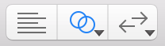
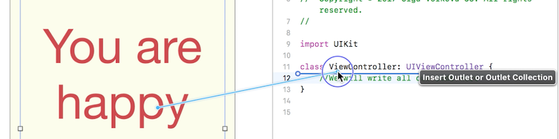
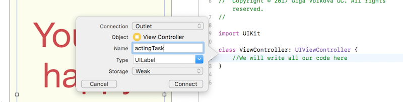

## 新建一个IOS项目
默认打开的是项目的配置文件, 配置文件里面有几个特殊配置:
* Display Name: 指的是应用名称, 它会显示在app strore和安装在用户的设备上
* Version: 格式如X.X, 以1.0开始, 应用的改进和修复导致第二个数字增加-1.1、1.2等. 主要的修改导致第一个数字增加- 2.0,3.0,0，等等.
这有助于通过浏览数字(版本和构建)来快速确定开发时间跨度。
* Devices: 应用的目标平台, iPhone, iPad or Mac
* Device Orientation: 该应用程序支持的方向是纵向，横向右，横向左, 也可以包括颠倒.

新建的项目主要有这两个文件:
* ViewController.swift : 用于编写代码
* Main.storyboard : 用于创建应用的用户界面, 默认里面包含一个空白的view, 可以在其中填充包含在Utilities panel下的Object Library里面的元素(标签, 按钮等).

## 关联代码和storyboard

关联ViewController.swift 和Main.storyboard, 使界面和代码关联. XCode工作区有几种工作模式,在XCode工具栏可以为编辑区切换不同的布局:

三种不同的布局:
* Standard Editor
* Assistant Editor
* Version Editor

先创建一个Outlet, 它是UI元素和Control之间的连接, 通过这个连接我们可以在代码块中访问所有UI元素的任何属性. 通过control-drag操作实现UI元素和Control之间的连接.  

Outlet配置弹框:

Xcode会添加如下语句到Control代码块中:
```javascript
@IBOutlet weak var actingTask: UILabel!
```
这行变量声明与普通声明变量形式有点不一样, 关键词@IBOutlet表示该变量与interface builder(因此用前缀IB)连接. weak, 还有个可选项就是strong, strong表示Outlet引用的interface object必须存在, 而weak不需要它存不存在. 后面的!符号是Swift的一个更高级的组件,表示Outlet引用的interface object必须存在.
## 在Swif中声明变量
```
var employeeCount = 16
```
在创建变量时,指定变量类型
```
var employeeCount: Int = 16
```
三种声明变量的方式
```
var aVariableName = aValue // A name and an assigned value
var aVariableName: VariableType = aValue // A name, and an assigned value
var aVariableName: VariableType // A name and a type
```

## Code in IOS Application
IOS应用的代码部分使用MVC (Model View Controller) 的软件架构模式

控制器Controller是整个系统的核心, 它接收来自Model的数据(应用的逻辑), 显示数据到View